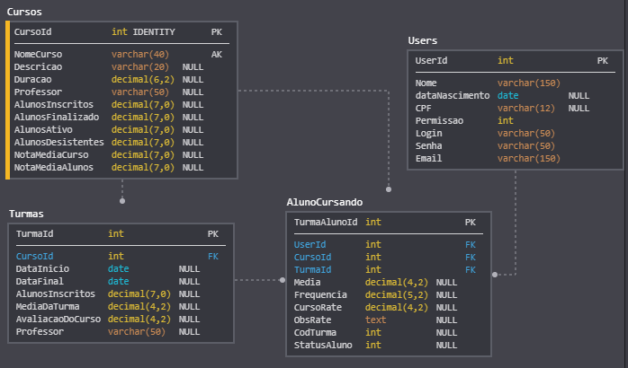

### Easy-Course-Management
Objetivo: Criar um sistema para alunos e professores, onde haverá os alunos terão acesso as notas, frequência e os materiais que serão disponibilizado no portal.

Motivo do projeto: Estou estudando Laravel e para desenvolver projetos mais complexos no futuro, estou fazendo esse projeto em Licença **MIT**

Veja alguns prints do sistema [Clique Aqui](https://github.com/dshy1/Easy-Course-Management/blob/master/Prints.md).

Permissões e Funcionalidades
**Admin**
- Cadastrar o nome e duração do Curso.
- Cadastrar novo aluno ou professor.
- Criar uma turma para um determinado curso.
 
 
**Professor**
- Ver lista das turmas que ele dá aula.
- Controlar frequência do aluno.
- Publicar as notas das avaliações.
- Publicar os materiais e as estrutura das aulas.
 

**Aluno**
- Ver turma (Professor, horários, curso).
- Ver notas.
- Ver frequência.
- Baixar os materiais disponíveis.

## DB Scheme

